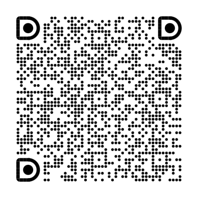

# Ant Design Skill  🫶  Community

*面向 AI 时代的设计系统表达与实践，构建人机协同设计新生态。*

### ☻ 关于我们

Ant Design Skill 是 Ant Design 官方设计团队出品的，面向 AI 的设计系统表达与实践，把设计系统从”人理解的规范”升级为”AI 也能执行的设计能力”，构建人机协同设计新生态。

### ✸ 专业特点

- **精选设计资产**：聚焦 AI 难以高质量生成的设计资产，持续打磨质量与一致性。
- **专业设计知识**：注入设计师的规则、经验与思考，让 AI 理解设计逻辑，做出专业设计决策。
- **真实业务验证**：源于真实业务实践，经评测验证，保障企业级复杂场景可用。

### ❖ 我们提供

- **Ant Design Skill 技能包** — 开箱即用的 AI 技能，直接生成符合 Ant Design 设计规范的界面
- **Design Skill 构建指南** — 一套完整的方法论与工具链，帮助你构建属于自己的 Design Skill

### ❤︎ 社区交流

欢迎更多设计师一起成为 Builder！

前往 [GitHub Discussions](https://github.com/AntGroupDesign/Ant-Design-Skill/discussions) 交流想法、提问和分享实践：

- 一起交流 Design Skill 创造方法体系
- 一起构建 AI 时代的设计系统表达方式
- 一起探索 Design + AI 的新协作模式

扫码加入钉钉交流群：

### ❋ 参与贡献

我们欢迎各类贡献，包括但不限于：

- 提交 Issue 反馈问题或建议
- 提交 Pull Request 参与代码贡献
- 完善文档与使用示例

### ✦ 更多生态

- [Ant Group Design AI Lab](https://antdesignsystem.alipay.com/)
- [Ant Design](https://ant.design/index-cn)
- [AntV](https://charts.ant.design/)

